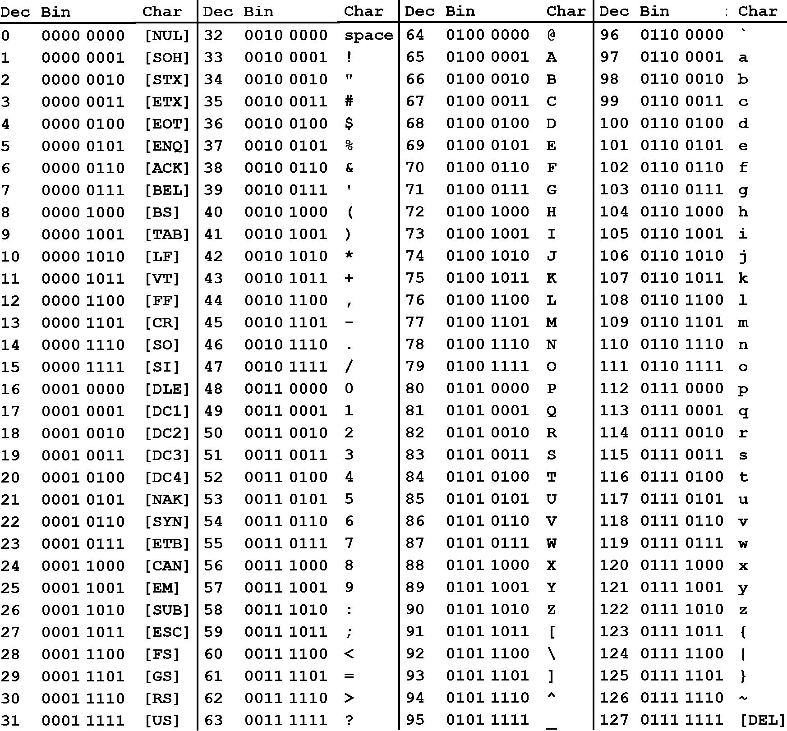
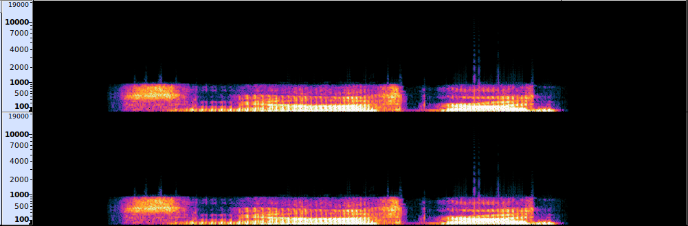
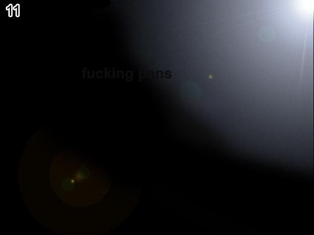
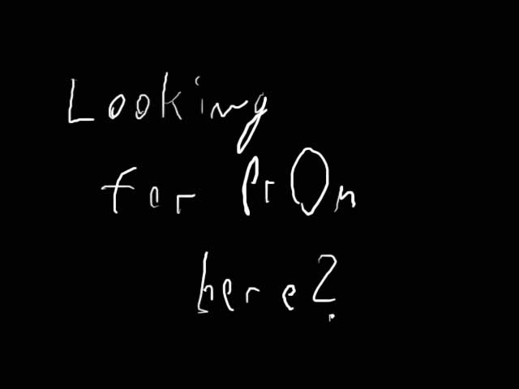
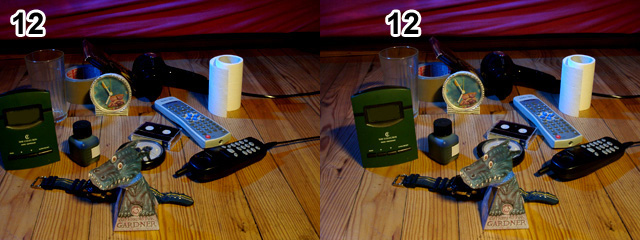
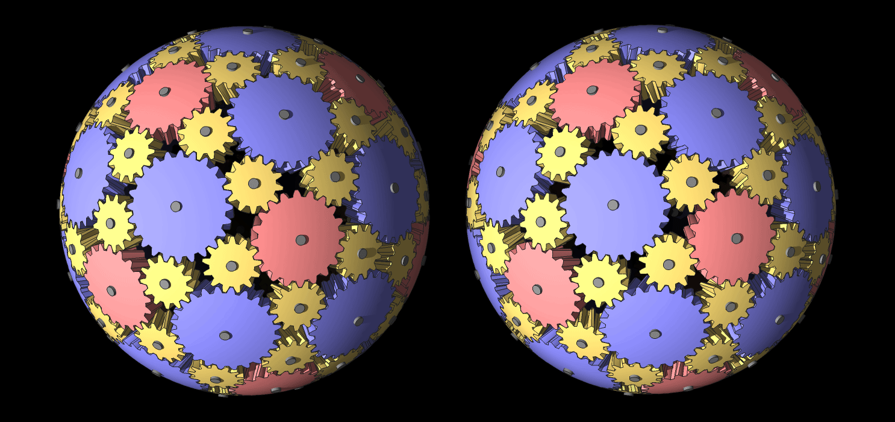
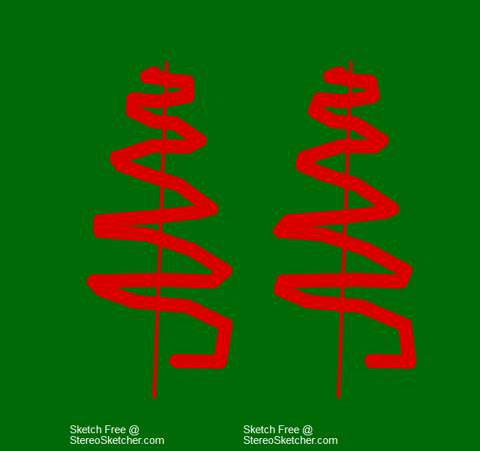

# Not Pron

## Table Of Contents
* [Summary](#summary "Summary Section")
* [Starting The Riddle](#starting-the-riddle "Starting Section")
* [Level 1](#level-1 "Level 1 Section")
* [Level 2](#level-2 "Level 2 Section")
* [Level 3](#level-3 "Level 3 Section")
* [Level 4](#level-4 "Level 4 Section")
* [Level 5](#level-5 "Level 5 Section")
* [Level 6](#level-6 "Level 6 Section")
* [Level 7](#level-7 "Level 7 Section")
* [Level 8](#level-8 "Level 8 Section")
* [Level 9](#level-9 "Level 9 Section")
* [Level 10](#level-10 "Level 10 Section")
* [Level 11](#level-11 "Level 11 Section")
* [Level 12](#level-12 "Level 12 Section")
* [Level 13](#level-13 "Level 13 Section")
* [Level 14](#level-14 "Level 14 Section")
* [Level 15](#level-15 "Level 15 Section")
* [Hints](#hints "Hints Section")

---

## Summary
Notes relating to the individual levels in the not pron internet riddle created by CEO of [Supra Games](https://deathball.net/supragames/ "Supra Games Wesite") and game developer [David Munnich](https://twitter.com/DavidM1337 "David Munnich Twitter").

Read more about this riddle at the [not pron wikipedia](https://en.wikipedia.org/wiki/Notpron "Not Pron Wiki") page.

---

## Starting The Riddle
The game can be accessed by visiting the website [here](http://www.deathball.net/notpron "Not Pron Website") and clicking the start button which redirects to the [first level](http://notpron.org/notpron/levelone.htm "Not Pron Level 1")

---

## Level 1

Level 1 is pretty straight forward. Just an image with an [html area map](https://www.w3schools.com/tags/tag_area.asp "W3 Info On Area Tag") over the door which when clicked on leads to level 2. One interesting thing to note though is that in the HTML source code there is a comment directed at users all the way at the bottom. This leads me to believe further levels will require reading source code. The comment reads:

```html
<!--good idea, but the source is one screen ahead of this one-->
```

### [Back To Top](#not-pron "Top Of Page")
---

## Level 2

Level 2 contains another image of a door with another area map (on the door knob) that when hovered over triggers the following JavaScript alert...

> The door is closed. Trick it or reach LEVEL3 in a different way! (Address? Where is the hand pointing?)

The hand reffered to in the alert is pointing up at the URL and the alert mentions the word address as a hint.

Logically the next step is URL address changing.

* Going from http://notpron.org/notpron/not/level2.htm
* To http://notpron.org/notpron/not/level3.htm
* Redirects us to http://www.deathball.net/notpron/false/movetotheothersite.php

Some things to note about this level are that the image area map is hidden away within a font tag as seen below. This is also the first time hints have been presented and I will link them within the [hints section](#hints "Hints Section") of this document.

```html
<font color="#FFFFFF">
    <map name="no">
      <area shape="rect" coords="161,350,189,400" onmouseover="returnTruth();return true;" href="../false">
    </map>
    <br>
    <a href="http://deathball.net/notpron/hints.htm" target="_blank"><font size="5" face="Arial">Hints
    and Rules</font></a><br>
    <br>
    <br>
    <br>
    <br>
    <br>
</font>
```

### [Back To Top](#not-pron "Top Of Page")

---

## Level 3

Level 3 contains a GIF that occasionaly flashes the words:

> Stop being so negative

And a comment in the HTML source code that reads:

```html
<!-- read the whole url -->
```

So changing the negative value in the URL into a positive should lead us to level 4.

* Negative URL - http://www.deathball.net/notpron/false/movetotheothersite.php
* Positive URL - http://www.deathball.net/notpron/true/movetotheothersite.php

### [Back To Top](#not-pron "Top Of Page")

---

## Level 4

Level 4 presents us again with another image with an area map within. It can be found on the object in front of the two pillows. When this object is clicked on we recieve a JavaScript alert that reads:

> Password Hint: LightThisPlaceNow

After which a login prompt is shown which asks for our username and password.

These credentials can be found in the photo underneath the light on the nightstand.

Somewhat obscured there are two lines of morse code that read:

> ...- --- --- -.. --- --- -- .- --. .. -.-.

Taking that morse code and plugging it into [CyberChef](https://cyberchef.org/ "Cryptography Tool") reveals the following message:

> voodoo magic

Plugging these values into the login form redirects us to Level 5.

* Login: voodoo
* Password: magic

### [Back To Top](#not-pron "Top Of Page")

---

## Level 5

Level 5 includes an image of a CD case and a remote control on a table with some text at the bottom that reads:

> Eyes like an angel smiles like a devil

The name of the band on the CD case is [Big Bad Voodoo Daddy](https://en.wikipedia.org/wiki/Big_Bad_Voodoo_Daddy "Band Wikipedia")

The image area map can be found over the power button on the remote control.

Again this area map on click produces another login form, the credentials of which can be found by performing a simple google search of those lyrics and using the song name ([simple songs](https://www.youtube.com/watch?v=SCgdCj2myRU "Song On YouTube")) on the form.

* Username: simple
* Password: songs

### [Back To Top](#not-pron "Top Of Page")

---

## Level 6

Level 6 contains an image of pipes with an area map in the lower left corner. Again clicking on this area produces an alert followed by a login form.

The alert reads:

> Password Hint: anagram

So now all we have to do is find the password.

Scrolling down the page you can find the word "up". Hinting at some hidden information above this location. There are 2 ways you can find this...

1. Highlight the page revealing the black text.

2. Read the HTML code realizing there is a second HTML page being loaded in via the [iframe](https://www.w3schools.com/tags/tag_iframe.asp "W3 Iframe Information") tag. This document is trying to obscure the text by setting the body text color to all black. Within this document is a paragraph tag with the hidden information.

The hidden information reads:

> 108 105 108 107 101 122 111 110

These numbers all lay in the range (97-122) of lowercase [ASCII](https://en.wikipedia.org/wiki/ASCII "ASCII Wikipedea") characters.



Another way to tell that these are ASCII characters is by reading the hidden comment in the HTML source code all the way at the bottom which reads:

```html
<!--ascii is an alternative-->
```

Once translated, these codes reveal the word:

> lilkezon

Rearranged this creates the word:

> killzone

Entering this into our login form redirects us to level 7.

**CREDENTIALS -**
* Login: kill
* Password: zone

### [Back To Top](#not-pron "Top Of Page")

---

## Level 7

Ok, so this level was pretty difficult. It starts with an image of a crumpled twix wrapper in front of a mirror. There is no area map within the image and no text on the page to guide you. There is a new note in the left corner though which reads the following:

> -From now on almost all levels require you to have a look at the source code.

In the HTML source code we can find the following comments:

```html
<!--times have changed in deutschland -->
...
<!--what candy wrapper is it?-->
```

If we take a look at the hint for this level it says:

> Carefully read the URL. It's telling you what to do.

Examining the URL for this level something stands out. The strange names for the directory and file.

> /sdrakcab/tieman.htm

This is just backwards for:

> /backwards/nameit.htm

So at first I thought this level would be easy and the solution would be:

> /sdrakcab/xiwt.htm

But this led to a dead end, so I tried every possible combination of reversing directory and file names I can think of and while some led to 404 errors, others were more interesting. Some of these combinations produced unique messages. These are those links and their messages starting from the Level 7 landing page.

1. http://www.deathball.net/notpron/sdrawkcab/tieman.htm
    > Starting Point

2. http://www.deathball.net/notpron/sdrawkcab/nameit.htm
    > No, name what you see on the pic, go back!

3. http://www.deathball.net/notpron/sdrawkcab/xiwt.htm
    > too new

4. http://www.deathball.net/notpron/sdrawkcab/twix.htm
    > wenoot

5. http://www.deathball.net/notpron/backwards/twix.htm
    > i'd like to have it backwards tho

6. http://www.deathball.net/notpron/backwards/xiwt.htm
    > no, i want backwards backwards

7. http://www.deathball.net/notpron/backwards/tieman.htm
    > no, just name it

8. http://www.deathball.net/notpron/backwards/nameit.htm
    > do it......name IT

At this point I started to wonder what I was doing wrong and decided to rethink this whole process. These messages continue to tell me to "just name it" then there was the weird hint in the HTML source code.

```html
<!--times have changed in deutschland-->
```

Then it hit me, maybe Twix has a different name in Germany.

Which led me to the [Twix Wikipedia](https://en.wikipedia.org/wiki/Twix "Twix Wiki") page.

Apparently Twix used to be called Raider.

Which led to me to the 9th interesting message:

9. http://www.deathball.net/notpron/sdrawkcab/raider.htm
    * dnuorayawrehto

> Backwards for otherwayaround

And finally the way to level 8:

> http://www.deathball.net/notpron/sdrawkcab/rediar.htm

### [Back To Top](#not-pron "Top Of Page")

---

## Level 8

Level 8 contains another image with an area map. This time it's right over the soundhole of the guitar. When clicked on, a JavaScript alert pops up giving us the first hint followed by a login form. The alert reads:

> Password Hint: mom, he formatted my second song

Below the image there is text that reads:

> JAY should PACK his stuff

Interesting things to note on this level are that so far every page has been loading up an mp3 file stored at:

> http://www.deathball.net/notpron/stuff/mus1.mp3

But this time in the HTML source code we can see an attempt at loading a second mp3 stored at:

> http://www.deathball.net/notpron/stuff/mus2.mp3

Suspiciously, the [audio tag](https://www.w3schools.com/TAGS/tag_audio.asp "W3 Docs For Audio Tag") for this second mp3 is broken causing it to never be loaded into the document.

```html
  <audio src="../stuff/mus1.mp3" autoplay loop></audio>
  <au dio src="../stuff/mus2.mp3">
```

Theres also an interesting comment in the HTML:

```html
<!-- water became wine -->
```

Following the link to the second mp3 we get the following error message:

> no video with supported format and mime type found

If we compare both files with "view source" it becomes clear that mus2.mp3 is not an mp3 it's an image. There are clear strings of text referencing Adobe Photshop.

Downloading this file reveals it is a JPEG of the [level 9 login credentials.](./Level-8-Assets/mus2mp3.jpeg "Image Of Login Credentials")

* Login: inverted
* Password: tenthlevel

Additional Information - Running [exiftool](https://en.wikipedia.org/wiki/ExifTool "Exiftool Wikipedia Page") on the downloaded JPEG reveals a ton of metadata. One of which might be a link to another level. You can find a copy in the [metadata.txt](./Level-8-Assets/metadata.txt) file within the Level-8-Assets folder.

### [Back To Top](#not-pron "Top Of Page")

---

## Level 9

Level 9 is under the /notpron/luv2music directory in a file called paulisdead.htm and the document title for this page (name on the tab) is "revolution".

The page contains another JPEG with an image map over the number 9 in the upper left corner. Clicking this area reveals this levels hint followed by the login prompt. The hint reads:

> Password Hint: colorful

Underneath the image we can find the following text:

> tears under john's mad notes of pain
>
> did he answer demon's call now

Looking at the directory name, file name, page title, and text under the image it's clear these are all Beatles references. Even the level number 9 is a reference to the notorious Beatles song "Revolution 9".

But Paul is still alive and changing the URL from:

> http://www.deathball.net/notpron/luv2music/paulisdead.htm

To:

> http://www.deathball.net/notpron/luv2music/paulisalive.htm

Gives us an easter egg that reads:

> yeah i know he is alive, but don't waste your time with the Mc!

And if you Google "[Paul is dead](https://en.wikipedia.org/wiki/Paul_is_dead "Paul Is Dead Wikipedia")" you'll get articles about the infamous conspiracy theory that Paul McCartney died and was replaced by a look alike.

This level is also the first page so far to contain zero comments in the HTML source code.

Instead you'll find something interesting in the repeated use of the [span](https://www.w3schools.com/tags/tag_span.asp "W3 Docs On Span Tag") tags. They wrap around single letters and serve no purpose. They're not being used by a CSS or JavaScript file. They're just suspiciously there.

```html
<span class="not">t</span>ears <span class="not">u</span>nde<span class="not">r</span> joh<span class="not">n</span>'s <span class="not">m</span>ad not<span class="not">e</span>s <span class="not">o</span>f pai<span class="not">n</span>
<br><span class="not">d</span>id h<span class="not">e</span> <span class="not">a</span>nswer <span class="not">d</span>e<span class="not">m</span>on's c<span class="not">a</span>ll <span class="not">n</span>ow
```

Taking every letter within the span tags reveals the following two lines:

> turn me on
>
> dead man

Which happen to be the login credentials for level 10. Additionally these are the lyrics that can be heard when listening to Revolution 9 backwards, according the the "Paul is dead" conspiracy theorists.

* Username: turnmeon
* Password: deadman

### [Back To Top](#not-pron "Top Of Page")

---

## Level 10

Level 10 contains an image of a gold ring on top of a book. The ring has an area map around it. When the ring is clicked on we receive a JavaScript alert with a password hint, followed by a login form.

The password hint reads:

> Password Hint: operator woman said it

The URL for this page is:

> http://www.deathball.net/notpron/wrong/roawr.htm

The document title is:

> he was impatient

Examining the HTML source code reveals some interesting information. An MP3 file we haven't seen yet called mus3.mp3, and two comments.

```html
<audio src="../stuff/mus3.mp3" autoplay loop></audio>
...
<!--quick quick, don't let me wait-->
...
<!--%SystemRoot%\System32\sndrec32.exe can capture "what u hear"-->
```

The second HTML comment tells us to record what we hear. Instead we can just download that MP3 file we found ([mus3.mp3](http://www.deathball.net/notpron/stuff/mus3.mp3 "mus3.mp3 location")).

Now at this point, I knew that there was hidden data within the audio file, but to be honest I had no idea how to get it or what I was looking for. The audio file just sounded like incomprehensible white noise. So I looked up some YouTube videos on how to hide/find data in audio files.

To start I needed a program for working with audio files and ended up choosing [Audacity](https://www.audacityteam.org/ "Audacity Website").

Once I loaded the mus3.mp3 file into Audacity I checked if the info was hidden within the [spectogram](https://en.wikipedia.org/wiki/Spectrogram "Spectogram Wikipedia").



But there was nothing there. Then I remembered the HTML comment and the page title of the level.

> Document Title: He was impatient
>
> HTML Comment: quick quick, don't let me wait

After that I sped up the audio and started to notice that the once incomprehensible audio started to sound more and more like something real.

Then I reversed the audio and in a deep voice the words "Dark Times" could be heard.

It becomes clearer too once the pitch is raised.

Below are the steps needed to hear the words hidden within the audio file. Along with links to the audio files I saved at the different phases.

1. Effect -> Pitch and Tempo -> Change Speed -> Speed Multiplier (5.000)
    * Sounds like [this](./Level-10-Assets/mus3-sped-up.mp3 "mus3.mp3 Sped Up")

2. Effect -> Pitch and Tempo -> Reversed
    * Sounds like [this](./Level-10-Assets/mus3-sped-and-reversed.mp3 "mus3.mp3 Sped Up and Reversed")

3. Effect -> Pitch and Tempo -> Change Pitch -> Percent Change (75.000)
    * Sounds like [this](./Level-10-Assets/mus3-sped-reversed-and-pitch-raised.mp3 "mus3.mp3 Sped, Reversed, Pitch Raised")

This leads us to the following login credentials:
> Username: dark
>
> Password: times

Additional Notes -

The [previous level](#level-9 "Level 9") was about a song played backwards revealing a hidden message. This was foreshadowing the reversal of the mus.mp3 file in level 10.

The word "**roawr**" in the roawr.htm file is an anagram of "arrow".

Switching the /right directory to /wrong reveals an easter egg.

* http://www.deathball.net/notpron/right/roawr.htm
    * its not that easy, fool

### [Back To Top](#not-pron "Top Of Page")

---

## Level 11

Level 11 contains an image of the inside of an oven where something is being cooked (casserole?). The image contains an area map over the oven light. When clicked on, this area map triggers a JavaScript alert followed by a login prompt. The alert reads:

> Password Hint: follow the truth

The URL for this page:

> http://www.deathball.net/notpron/reality/mystery.htm

The document title is:

> ahead of its time

The HTML source code is suspiciously short at only 16 lines. There are no helpful comments.

```html
<!--IRC Quakenet #notpron-->
<html>
    <head>
        <title>ahead of its time</title>
        <audio src="../stuff/mus3.mp3" autoplay loop></audio>
        <LINK REL="stylesheet" TYPE="text/css" HREF="../style.css" />
    </head>
    <body>
    <center>
         
        <map name="Map">
            <area shape="circle" coords="534,152,29" href="../blame/crossview.htm"  onclick="alert('Password Hint: follow the truth')">
        </map>
    </center>
    </body>
</html>
```

The only thing we have to go on is the image. We're told something is "ahead of its time", to "follow the truth", and that there is some "mystery".

At first I thought that "ahead of its time" might refer to the [HTTP Headers](https://developer.mozilla.org/en-US/docs/Web/HTTP/Headers "Mozilla Docs On HTTP Headers") but there was nothing out of the ordinary there.

After that I thought maybe something was hidden in the image [file header](https://csrc.nist.gov/glossary/term/File_Header "What Is A File Header?"). Again nothing out of the ordinary there either. I tried the [strings command](https://www.howtogeek.com/427805/how-to-use-the-strings-command-on-linux/ "Article On Strings Command") on the file to look for suspicious text but nothing interesting came back.

Then I tried [exiftool](https://en.wikipedia.org/wiki/ExifTool "Exiftool Wikipedia") on the image to extract metadata, but there was nothing.

At this point I started thinking maybe one of the levels before contained the answer, making it "ahead of its time". This led me to checking the metadata on every image. I saved a copy of [every image](./Images-And-Metadata/Images/ "All Images So Far") and its [metadata](./Images-And-Metadata/Image-Metadata/ "All Image Metadata So Far") in the "[Images-And-Metadata](./Images-And-Metadata/ "Images-And-Metadata Folder")" folder.

This is where I discovered a couple interesting things:

1. There is a file missing. Where is **screen11.jpg**? Why is level 11's image being saved as the image to level 12 instead?

2. Why is level 8's image being saved as 8a (screen8a.jpg) instead of just the level number like all the others (screen7.jpg, screen9.jpg)? Is there another hidden image on that level?

Image names

1. [screen1.jpg](./Images-And-Metadata/Images/screen1.jpg "Level 1 Image")
2. [screen2.jpg](./Images-And-Metadata/Images/screen2.jpg "Level 2 Image")
3. [screen3.gif](./Images-And-Metadata/Images/screen3.gif "Level 3 GIF")
4. [screen4.jpg](./Images-And-Metadata/Images/screen4.jpg "Level 4 Image")
5. [screen5.jpg](./Images-And-Metadata/Images/screen5.jpg "Level 5 Image")
6. [screen6.jpg](./Images-And-Metadata/Images/screen6.jpg "Level 6 Image")
7. [screen7.jpg](./Images-And-Metadata/Images/screen7.jpg "Level 7 Image")
8. [screen8a.jpg](./Images-And-Metadata/Images/screen8a.jpg "Level 8a Image")
9. [screen9.jpg](./Images-And-Metadata/Images/screen9.jpg "Level 9 Image")
10. [screen10.jpg](./Images-And-Metadata/Images/screen10.jpg "Level 10 Image")
11. [screen12.jpg](./Images-And-Metadata/Images/screen12.jpg "Level 12 Image")

Going back to the URL for the image on level 11:

> http://www.deathball.net/notpron/reality/screen12.jpg

And looking for the lost file:

> http://www.deathball.net/notpron/reality/screen11.jpg

Reveals the existence of the missing image:



And our login credentials for level 12:

> Login: fucking
>
> Password: pans

Additional Notes -

I went back to see if the 8b image existed and it does.

Changing:

> http://www.deathball.net/notpron/sdrawkcab/screen8a.jpg

To:

> http://www.deathball.net/notpron/sdrawkcab/screen8b.jpg

Reveals:



There's also an image for level 3. The only level so far to use a GIF instead of image. It can be found by replacing the gif extension with jpg.

### [Back To Top](#not-pron "Top Of Page")

---

## Level 12

Level 12 contains an image of two side by side, nearly identical scenes of random items across a floor. and this time there are two area maps over the image. Both over the number 12.



Clicking on the area maps triggers the login prompt for level 13 and a password hint which reads:

> Password Hint: attention whore

The URL for this level is:

> http://www.deathball.net/notpron/blame/crossview.htm

And the document title is:

> stereo

Underneath the image is the following subtext:

> I'm ruining the third dimension!

Also the Google search bar is back which means we're going to have to look something up.

Inspecting the HTML source code we can find four interesting comments:

```html
<!-- switch pics for parallel view -->

<!--name me-->

<!--GIF me my picture back-->

<!--http://www.deathball.net/temp/dragon.zip-->
```

The "name me" comment is right next to the words "I'm ruining the third dimension".

```html
<p><font color="#FFFFFF" size="5" face="Arial">I'm ruining the third dimension!<!--name me--></font></p>
```

Visiting the [URL in the comments](http://www.deathball.net/temp/dragon.zip "URL From The Comments Section"), we're able to download a ZIP file called [dragon.zip](./Level-12-Assets/dragon.zip "dragon.zip file") which contains a file called [dragon.wmv](./Level-12-Assets/dragon.wmv "dragon.wmv File").

But the video kind of leads nowhere, at least for me it did.

Going back to the [level 12 image URL](http://www.deathball.net/notpron/blame/realscreen12.jpg "Level 12 Image Location") and looking for a GIF based on the HTML comment "GIF me my image back". You'll find that a gif version of the images does exist. You can find it by:

Changing:

> http://www.deathball.net/notpron/blame/realscreen12.jpg

To:

> http://www.deathball.net/notpron/blame/realscreen12.gif

But still, no password.

Looking at the other clues, I decided to look up "what is a crossview?" in DuckDuckGo and one of the results stuck **way** out.

A [Reddit page](https://www.reddit.com/r/CrossView/ "Reddit CrossView Community") with the title:

> CrossView: stereoscopic 3D using cross-eyed freeviewing of side-by-side stereograms

According to the [r/CrossView Wiki](https://www.reddit.com/r/CrossView/wiki/index/ "Reddit Wiki On CrossViewing"):

> Cross view images, or side-by-side stereoscopy, is a cool way of seeing 3D pictures without needing technologically advanced screens or special glasses.
>
> How To View: Simply cross your eyes halfway between the pictures until both images overlap one another (3 images total), holding your view on the central image, and with a little patience, the image should 'push' into focus- you'll know it when you see it!

They also have a sister-sub called [r/ParallelView](https://www.reddit.com/r/ParallelView "ParallelView SubReddit") for "reversed crossview" or "pseudo-stereo".

So this pretty much hit on everything in this level. The title being "stereo", comment saying "switch pics for parallel view", split images and most importantly the subtext that says "I'm breaking the third dimension".

To understand what is "breaking the third dimension" it probably helps to see some CrossView Images that work really well. So I found some really good ones.

Gear Ball -



Rotating Heliosphere -


Christmas Trees -



But trying to CrossView the side by side image on level 12 doesn't work as well as these others because one of the objects is ruining the effect. The remote control.

This object gives us the following login credentials:

> Login: remote
>
> Password: control

### [Back To Top](#not-pron "Top Of Page")

---

## Level 13

Level 13 contains an image of a clock and a ring, there are 3 numbers on the image and this time there are 6 image area maps, instead of the usual 1. Five of these area maps are scattered around and look like slight discolorations in the image but they're shaped like letters. Hovering over each one triggers a different alert. The other and main area map can be found right over the clock. Clicking on this reveals a password hint, followed by the login form.

The three numbers on the page:

* 13 (Level number area)
* 4 (On the clock)
* 10 (On the ring)

Message when clicking on the clock:

> Password Hint: I live there.

Text underneath image:

> no maths

Level URL:

> http://www.deathball.net/notpron/ps/afterdeath.htm

Document title:

> lucy not in the sky

Examining the HTML source code reveals only one comment:

```html
<!-- he's been a bad boy -->
```

The alerts produced when hovering over the discolorations claim to be part of some order (out of 5 total). But two are variable (x). The only ones that are numbered are positions 2, 3, and 5. 1 and 4 are x.

* 2 of 5 - looks like it could be the letter m, letter E, or number 3.

* 3 of 5 - Letter V

* 5 of 5 - Letter L

* x of 5 (lower right) - Looks like uppercase I, or lowercase l.

* x of 5 (upper left) - Letter D.

Trying to arrange these letters to form a word we can start by filling in the spaces we know for sure (3 and 5).

* __V_L

In the second space we have 3 possibilities (m, E, 3).

* _mV_L

* _EV_L

* _3V_L

We know one of the letters is D so now we can try to put that letter in one of the empty spaces. Starting with the first empty position.

* DmV_L

* **DEV_L**

* D3V_L

And there it is DEV_L immediately sticks out. We know the symbol in the lower right (x of 5) was either I or l. Now it becomes obvious it was an I. The word is DEVIL.

Now we have the username, and the password hint told us "i live there". So that gives us the following login credentials for level 14:

> username: devil
>
> password: hell

Additional Information -

Messing around with the death themed URL returns some interesting easter eggs. I've only been able to find three of them and I'm not sure if any more exist. Below are the three I found and the text those URLS return.

1. http://www.deathball.net/notpron/ps/beforedeath.htm

    * Have I told you about the room which is full of people who find you to be horribly uncreative?

2. http://www.deathball.net/notpron/ps/afterlife.htm

    * no, evil lucifer is dead

3. http://www.deathball.net/notpron/ps/beforelife.htm

    * man you are tricky!

### [Back To Top](#not-pron "Top Of Page")

---

## Level 14

Level 14 contains an image that looks very similar to the image from level 5. A remote control resting on the "Big Bad Voodoo Daddy Live" album and again the image area map is over the power button. The level number 5 is crossed off and 14 is replacing it.

Level URL:

> http://www.deathball.net/notpron/neo/beenthere.htm

Document Title:

> He knew the feeling...

Clikcking on the area map triggers the following message:

> Password Hint: quoi?

HTML Comments:

```html
<!--what language is the password hint? use it properly!-->
```

This level had me going down a lot of dead ends. From trying the level 5 credentials on this level (in English and French). Looking up the lyrics to every song on the Big Bad Voodoo Daddy Live album for references of the Matrix (based on neo being the directory name) or looking for French lyrics.

It wasn't until I couldn't think of anything else to try that it became pretty obvious.

The password is a French word and the only other hints are Neo, been there, he knew the feeling.

On a level almost identical to one we've done before.

What do Neo, a feeling, being somewhere again, french words have to do with eachother?

A feeling of being somewhere again in French that Neo experienced.

**Deja Vu**

These were the French words that finally worked as the login credentials.

> Deja
>
> Vu

### [Back To Top](#not-pron "Top Of Page")

---

## Level 15


### [Back To Top](#not-pron "Top Of Page")

---

## Hints

### [Level 1](#level-1 "Level 1 Notes")

* If this level is too hard, give up and go away. No don't!
Where do you open a door? Click that part in the picture!

### [Level 2](#level-2 "Level 2 Notes")

* The popup is telling you to trick it. Maybe use something else than your mouse to get rid of it, so you get the link that it is covering!

### [Level 3](#level-3 "Level 3 Notes")

* Stop being negative, will ya? Stop trying to click something, there is nothing! Read the address carefully. What can you "turn on"?

### [Level 4](#level-4 "Level 4 Notes")

* Is anything dark here? Light it maybe? How? Got programs for that? Do you see something now? What sort of code could it be?

### [Level 5](#level-5 "Level 5 Notes")

* Carefully read the URL. There are at least 2 things that can help you.
Found the right thing in google? Stop thinking too difficult, just need 2 words for Username/Password!

### [Level 6](#level-6 "Level 6 Notes")

* Make up your mind about the "source code"!
Ever heard of ASCII Code?

### [Level 7](#level-7 "Level 7 Notes")

* Carefully read the URL. It's telling you what to do.

### [Level 8](#level-8 "Level 8 Notes")

* Second song? Which one could it be?
Who (or what) is Jay Pack? Say it loud!

### [Level 9 - 81](#level-9 "Level 9 Notes")

* Now you are on your own. No more help!
But keep in mind that all levels are different from each other!
It's easy to find cheats on the internet, but from the moment of your first cheating on, the whole fun is gone, stay strong!
Don't brag with your level progress, it makes no sense.

---

### [Back To Top](#not-pron "Top Of Page")